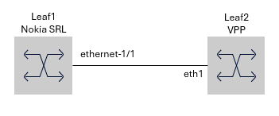
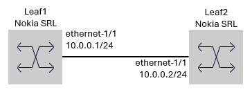
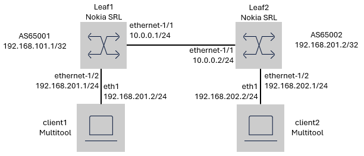

# ZANOG26 Containerlab workshop
Containerlab introduction material for [ZANOG26](https://iweek.org.za/) pre event workshop.

## 0.1 Getting connected
You should have received a note your instance ID and credentials on it with instructions to connect to an empty Virtual machine that can be used to follow along.

You can also follow along on personal hardware if x86 based without any changes to solution. If other architecture, some adaptations would be required.

At the end of each activity, a solution proposal is provided. This allows you to become unstuck or to continue with next activity since activities build on previous activities.

## 1. Containerlab installation

### Task 1.1 Install Containerlab

First order of business is to get [Containerlab installed](https://containerlab.dev/install/). Containerlab requires the following pre-requisites:
* A Linux user with sudo priviledges
* A working Docker engine installation
* NOS Container images (e.g. Nokia SR Linux, VPP) that are not downloadable from a container registry.

Containerlab provides a [quick-start script](https://containerlab.dev/quickstart/) that works with most DEB (Debian, Ubuntu) and RPM-based (Red Hat, CentOS, Fedora, etc) distributions and will take care of Docker install as well.

After logging in to your VM, run the following command:

```
curl -sL https://containerlab.dev/setup | sudo -E bash -s "all"
```

This one liner will install Docker and Containerlab.

> [!TIP]
> If you would like to use Containerlab without sudo, like the output of the installer suggests, you should add your user to this group using the following command:  
> 
> `usermod -aG clab_admins <insert your username here> && newgrp clab_admins`
> 
> and apply the new group membership to your terminal session (or log in and out from the SSH session).

The Containerlab installation can be tested by running `containerlab version`:
```
$ clab version

 ⣴⡾⠛⠛⠖ ⢠⣶⠟⠛⢷⣦ ⢸⣿⣧  ⣿ ⠘⠛⢻⡟⠛⠛  ⣾⣿⡀  ⣿⡇ ⣿⣿⡄ ⢸⡇ ⣿⡟⠛⠛⠃⢸⣿⠛⠛⣷⡄ ⣿⡇      ⣿⡇    
⢸⣿     ⣿⡇   ⣿⡇ ⢸⣿⠹⣧⡀⣿   ⢸⡇   ⣸⡏⢹⣧  ⣿⡇ ⣿⡏⢿⣄⢸⡇ ⣿⣧⣤⣤ ⢸⣿⣀⣀⣾⠇ ⣿⡇⠐⠟⠛⢿⡆ ⣿⡷⠛⢿⣆ 
⠘⣿⣄  ⡀ ⢻⣧⡀ ⣠⣿⠃⢸⣿ ⠘⣷⣿   ⢸⡇  ⢠⣿⠷⠶⢿⡆ ⣿⡇ ⣿⡇ ⢻⣾⡇ ⣿⡇   ⢸⣿⠉⢻⣧⡀ ⣿⡇⢰⡟⠛⣻⡇ ⣿⡇ ⣸⡿ 
 ⠈⠙⠛⠛⠉  ⠉⠛⠛⠋⠁ ⠘⠛  ⠈⠛   ⠘⠃  ⠚⠃  ⠘⠛ ⠛⠃ ⠛⠃  ⠙⠃ ⠛⠛⠛⠛⠃⠘⠛  ⠙⠓ ⠛⠃⠈⠛⠛⠙⠃ ⠛⠛⠛⠛⠁ 

    version: 0.74.3
     commit: 7eadb290a
       date: 2026-03-24T10:00:24Z
     source: https://github.com/srl-labs/containerlab
 rel. notes: https://containerlab.dev/rn/0.74/#0743
```

Containerlab runs in most places. Head over to [Containerlab installation](https://containerlab.dev/install/) instructions for [Windows WSL](https://containerlab.dev/install/#windows) or [macOS](https://containerlab.dev/install/#apple-macos). This also contains manual instructions and more.

### Task 1.2: Testing Containerlab

In order to test and validate your Containerlab installation, you can deploy a "hello world" topology example and test if traffic passes between two nodes.

The following command clones the provided Git repository, and deploys the Containerlab topology contained within.

```
clab deploy -t https://github.com/nardusleroux/clab-helloworld
```

Once deployed, you should be able to ping from `client1` to `client2`.

```
$ docker exec clab-helloworld-client1 ping 10.0.0.2
PING 10.0.0.2 (10.0.0.2): 56 data bytes
64 bytes from 10.0.0.2: seq=0 ttl=64 time=1.037 ms
```

Finally, we can clean up the topology we just created by doing

```
clab destroy -t https://github.com/nardusleroux/clab-helloworld
```

**What did we learn?**
* Containerlab has a command alias, `clab`, which is quicker to type.
* Containerlab topologies can be deployed from remote URLs, which is great to share labs.
GitHub repositories, direct URLs to Containerlab topologies, even S3 links work.
* `docker exec` can be used to run commands on containers deployed by Containerlab.
This is one of the two main methods (ssh being the other) for interacting with a node in a running Containerlab topology.

## 2. Creating and running your first Containerlab topology
A valid Containerlab topology consist of a name, and a set of nodes and links between them.

#### Important terminology

The most important objects within a Containerlab topology definition are:

- [Nodes](https://containerlab.dev/manual/nodes/#nodes)
Node object is one of the pillars of Containerlab. Within the `nodes` section of a Containerlab topology definition the actual containers that should be deployed are described. In most cases, each node represents a single container. This could be a network element (router, switch, firewall, etc), but can also be any other Linux-based container.
- [Links](https://containerlab.dev/manual/topo-def-file/#links)
Nodes can be deployed without links, but to create a network topology you would want them. In the `links` section, we can define links by providing pairs of `endpoints` for Containerlab to connect. An endpoint consist of a `node` and an interface of the node.

A [topology definition deep-dive document](https://containerlab.dev/manual/topo-def-file/) provides a complete reference of the topology definition syntax.

#### Task 2.1 - Your first lab topology

Containerlab supports [over 50 different types of Network OSes](https://containerlab.dev/manual/kinds/) that can be ran inside a topology. However, most commercial NOSes can only be downloaded with an active account for a given vendor's website or download portal.

In this workshop, we will use a freely downloadable NOS that do not require any registration:

- [Nokia SR Linux](https://learn.srlinux.dev/)

To get started, we will create a simple topology called `zanog26-workshop` consisting of 2 nodes with a single link in between them.

`leaf1` and `leaf2` will be an SR Linux nodes, running SR Linux 26.3, using the container image `ghcr.io/nokia/srlinux:26.3`. To make things simple, we will use the first available data-plane interface for both nodes. In the case of SR Linux, this is `ethernet-1/1`, and connect the two nodes to one another.



Based on the topology diagram and the [Containerlab topology format definition](https://containerlab.dev/manual/topo-def-file/#topology-definition-components), you should be able to define your first Containerlab topology in the file `zanog26-workshop.clab.yaml`

If you are already familiar with the Containerlab basics and want to skip over this exercise, you'll find the solution right here:

<details>
<summary>Task 2.1 solution</summary>

```yaml
name: zanog26-workshop

topology:
  nodes:
    leaf1:
      kind: nokia_srlinux
      image: ghcr.io/nokia/srlinux:26.3
    leaf2:
      kind: nokia_srlinux
      image: ghcr.io/nokia/srlinux:26.3

  links:
    - endpoints: ["leaf1:ethernet-1/1", "leaf2:ethernet-1/1"]
```

</details>

**What did we learn ?**
- How to define your own topology.

## 3. Running and extending your Containerlab Topology

Next step would be to deploy the lab and start with network configuration.

#### Task 3.1 - Deploying the topology

First deploy the lab using the `containerlab deploy` command.

> [!TIP]
> If your topology file has the .clab.yml postfix, `containerlab deploy` or `clab deploy` is sufficient to deploy the topology. You can also specifiy the topology file to use by using the `containerlab deploy -t <topologyfile.yml>`

During the deploy process, Containerlab will automatically download the necessary container images if they are not already present on the VM.

Once the nodes have started, Containerlab will give us an overview like this:
```
╭─────────────────────────────┬────────────────────────────┬─────────┬───────────────────╮
│             Name            │         Kind/Image         │  State  │   IPv4/6 Address  │
├─────────────────────────────┼────────────────────────────┼─────────┼───────────────────┤
│ clab-zanog26-workshop-leaf1 │ nokia_srlinux              │ running │ 172.20.20.3       │
│                             │ ghcr.io/nokia/srlinux:26.3 │         │ 3fff:172:20:20::3 │
├─────────────────────────────┼────────────────────────────┼─────────┼───────────────────┤
│ clab-zanog26-workshop-leaf2 │ nokia_srlinux              │ running │ 172.20.20.2       │
│                             │ ghcr.io/nokia/srlinux:26.3 │         │ 3fff:172:20:20::2 │
╰─────────────────────────────┴────────────────────────────┴─────────┴───────────────────╯
```

The nodes are automatically assigned a management IPv4 and IPv6 address by Containerlab, this can also be set statically in the topology file. Containerlab will also populate the hosts file to use the Name of the node to connect.

> [!Note]
>
> Given that most network OSes require additional configuration to be remotely manageable, Containerlab loads them with an initial configuration, just enough to give them a hostname, management connectivity and fixed credentials to SSH in with.
>
> Some node kinds go a bit further than that - Containerlab will automatically load SSH public keys, pre-configure node hardware configuration, as a convenience feature.

For most nodes, connecting to a node is just an ssh session to the node's name.

> [!Tip]
>
> The default username and password configured for SR Linux deployed via Containerlab is `admin` and `NokiaSrl1!`
> You can find out what default password is assigned to each node kind on the kind's documentation page in the Containerlab Kinds documentation page.

```
ssh admin@clab-zanog26-workshop-leaf1
Warning: Permanently added 'clab-zanog26-workshop-leaf1' (ED25519) to the list of known hosts.
................................................................
:                  Welcome to Nokia SR Linux!                  :
:              Open Network OS for the NetOps era.             :
:                                                              :
:    This is a freely distributed official container image.    :
:                      Use it - Share it                       :
:                                                              :
: Get started: https://learn.srlinux.dev                       :
: Container:   https://go.srlinux.dev/container-image          :
: Docs:        https://doc.srlinux.dev/25-10                   :
: Rel. notes:  https://doc.srlinux.dev/rn25-10-2               :
: YANG:        https://yang.srlinux.dev/v25.10.2               :
: Discord:     https://go.srlinux.dev/discord                  :
: Contact:     https://go.srlinux.dev/contact-sales            :
................................................................

(admin@clab-zanog26-workshop-leaf1) Password:
Loading environment configuration file(s): ['/etc/opt/srlinux/srlinux.rc']
Welcome to the Nokia SR Linux CLI.

--{ + running }--[  ]--
A:admin@leaf1#
```

Verify connectivity to leaf2 as well.

#### Task 3.2 - Adding configuration to your topology
Repeat the ping test we did in the "hello-world" lab between leaf1 and leaf2. Configure 10.0.0.1/24 and 10.0.0.2/24 on leaf1 and leaf2 respectively, and perform a ping test.

Your lab topology should now resemble the below:



Links to relevant documentations:

[SR Linux](https://learn.srlinux.dev/get-started/interface/)

>[!Tip]
> **SR Linux hints**
> <details>
> <summary>Navigating the CLI</summary>
>
>    * After logging in, you are in the **running** mode. This is the equivalent of operational mode on other network OSes, and you cannot make changes to the configuration in this mode.
>
>    * You can switch between modes using the `enter <mode>` command. The configuration mode is called the **candidate** mode
>
>    * The `info` command shows you the configuration in the current mode. `info <path>` shows you a specific path of configuration. To view the running configuration while in candidate mode, use `info from running <path>` (and vice-versa)
>
>    * `show` commands can be used to view certain reports about the switch. For example, `show interface brief` gives you an overview of the state of interfaces, while `show interface mgmt0` (or any specific interface name) gives you details about an interface
> </details>
> 
> <details>
> <summary>Configuring an interface</summary>
>
> - SR Linux uses a hierarchical, model-based configuration, based on the YANG model of SR Linux. The interface related settings can be found in the `interface` section
> - IP configuration cannot be directly applied to a physical interface, it must be done on a logical subinterface instead.
> - Parts of the configuration hierarchy must be explicitly enabled with the `admin-state enabled` setting. In this case, `interface X`, `subinterface Y` and `ipv4` are three sections that can have their admin-state toggled, and the first two are implicit enabled, the last section, however, is not.
> </details>
>
> <details>
> <summary>Assigning an interface to a network-instance</summary>
>
> - In SR Linux, all (logical) interfaces must be associated with a network-instance in order to pass traffic, and they are not associated to any by default.
> - A default network-instance can be used to provide base connectivity and control-plane protocols for other network-instances to be carried over. This is called the 'default' network-instance and has the type 'default'
> </details>
> 
> <details>
> <summary>Managing the configuration</summary>
>
> - The SR Linux CLI will tell you if there's a change in the candidate configuration compared to the running configuration - look for the **asterisk *** in the prompt.
> - SR Linux is transaction-based, and changes are applied atomically by performing a `commit`
> - You can use the `diff` command to see the difference between the candidate and running configuration.
> - You can validate your changes before applying the candidate configuration by doing a `commit validate`
> - Commit can be performed using `commit now` or `commit stay`. The former returns you to the **running** mode, the latter leaves you in **candidate** mode.
> * Commits can be performed in a safe manner by using `commit confirmed`. This starts a confirm timer, and if it expires, the commit is reverted, unless the commit is confirmed using the `tools system configuration confirmed-accept` command.
> - When the running configuration is changed, it is not saved to the disk yet. A **plus +** in the prompt marks an unsaved change in the **running** configuration compared to the startup configuration.
> - To save a running configuration in SR Linux, run the `save startup` command
> </details>

> - [x] **Task 3.2 solution**
>
> <details>
> <summary>leaf1 SR Linux configuration</summary>
>
> ```
> enter candidate
> # We have entered candidate mode, we can start configuring now
> set / interface ethernet-1/1 admin-state enable
> set / interface ethernet-1/1 subinterface 0 admin-state enable
> set / interface ethernet-1/1 subinterface 0 ipv4 admin-state enable
> set / interface ethernet-1/1 subinterface 0 ipv4 address 10.0.0.1/24
> # Assign the (logical) interface to the default network-instance we just created
> set / network-instance default admin-state enable 
> set / network-instance default type default
> set / network-instance default interface ethernet-1/1.0
> # Commit changes and return to running mode
> commit now
> # Save configuration
> save startup
> ```
> 
> </details>
> <details>
> <summary>leaf2 SR Linux configuration</summary>
>
> ```
> enter candidate
> # We have entered candidate mode, we can start configuring now
> set / interface ethernet-1/1 admin-state enable
> set / interface ethernet-1/1 subinterface 0 admin-state enable
> set / interface ethernet-1/1 subinterface 0 ipv4 admin-state enable
> set / interface ethernet-1/1 subinterface 0 ipv4 address 10.0.0.2/24
> # Assign the (logical) interface to the default network-instance we just created
> set / network-instance default admin-state enable 
> set / network-instance default type default
> set / network-instance default interface ethernet-1/1.0
> # Commit changes and return to running mode
> commit now
> # Save configuration
> save startup
> ```
> 
> </details>
>
> <details>
> <summary>Validation</summary>
> 
> ```shell
> A:admin@leaf2# ping 10.0.0.1 network-instance default
> Using network instance default
> PING 10.0.0.1 (10.0.0.1) 56(84) bytes of data.
> 64 bytes from 10.0.0.1: icmp_seq=1 ttl=64 time=54.5 ms
> 64 bytes from 10.0.0.1: icmp_seq=2 ttl=64 time=2.89 ms
> 64 bytes from 10.0.0.1: icmp_seq=3 ttl=64 time=2.84 ms
> 64 bytes from 10.0.0.1: icmp_seq=4 ttl=64 time=3.11 ms
> ^C
> --- 10.0.0.1 ping statistics ---
> 4 packets transmitted, 4 received, 0% packet loss, time 3004ms
> rtt min/avg/max/mdev = 2.841/15.824/54.451/22.301 ms
>
>
> --{ running }--[  ]--
> A:admin@leaf2#
> ```
> 
> </details>

### Adding startup configuration

To save time, you might not want to start from ground zero every time you deploy a lab. Even if you have the configurations saved, why not let Containerlab load the startup configuration for us as part of or topology.
    
Depending on the `kind` of the node, there might be several different ways on how to add a startup config to the simulated network element. Fortunately Containerlab is very well documented and more details can be found at the [Kinds section](https://containerlab.dev/manual/kinds/).
    
>[!WARNING]
> As a reminder: Containerlab applies some sane initial default configurations to some NOS's already. This is important to know when working with startup-configs. 
> 
> General rule of thumb is leave out management plane configuration, so management connectivity, SSH, authentication, etc, to avoid situations where Containerlab and your own startup configuration might want to modify the same configuration, and leave you with a node that you cannot connect to.
    
In SR Linux, there are two ways of adding a startup config to a node:
- A partial config added on top of the default Containerlab-added management configuration, either in the form of CLI commands, or in a hierarchical configuration format:

```yaml
name: partial-srl-startup
topology:
  nodes:
    srl1:
      kind: nokia_srlinux
      image: ghcr.io/nokia/srlinux:26.3
      # a path to the partial config in CLI format relative to the current working directory
      startup-config: ./configs/myconfig.cli
```

- A full SR Linux configuration file in, JSON format (note: the hierarchical config format is not a JSON!). This is the format you can find on SR Linux nodes' file systems:
    
```yaml
name: full-srl-startup
topology:
  nodes:
     srl1:
       kind: nokia_srlinux
       image: ghcr.io/nokia/srlinux:26.3
       # a path to the full config in JSON format relative to the current working directory
       startup-config: ./configs/myconfig.json
```

Full details on SR Linux startup configs can be found in the [SR Linux Containerlab documentation](https://containerlab.dev/manual/kinds/srl/).

In addition to file mounts, it is also possible to automatically execute CLI commands after container startup. This is useful for Linux client devices, to set up Linux interfaces' IP addressing, or create a bond interface, for example.

```yaml
name: linux-cmd-exec
topology:
  nodes:
    client1:
      kind: linux
      image: ghcr.io/srl-labs/network-multitool
      exec:
        - ip addr add 192.168.10.2/24 dev eth1
        - ip route add 192.168.11.0/24 via 192.168.10.1
        - ip link set eth1 up 
```

#### Task 3.3 - Adding startup configuration to your topology

The task will re-deploy the topology with the configuration used in the previous step now in the startup configuration files.

Save any configuration from leaf1 and leaf2 in the `./config` directory.

> [!IMPORTANT]
> Remember to **save your work** before you deploy the topology again.

For better understanding take a look at your working directory on your hypervisor.

Notice that a  directory prefixed with `clab-<topology-name>` has been created.  

This is called the _lab directory_, and is created on the first deployment of a topology by Containerlab. For node kinds that support it (such as SR Linux), this is where the state of the network OS is persisted between deployments.
    
For example, take a look at the `clab-zanog26-workshop/leaf1/config/config.json` file:
    
```json
{
  "_preamble": {
    "header": {
      "generated-by": "SRLINUX",
      "name": "",
      "comment": "",
      "created": "2026-04-09T12:39:18.595Z",
      "release": "v26.3.1",
      "enabled-yang-features"
  ...
}
```

This is configuration saved earlier on `leaf1`
    
Many other NOSes also support saving the node configuration with the `containerlab save` command.

Take care that using the `containerlab -c` command-line flag in deploy and destroy commands removes the lab directory created by Containerlab.  
Next execute the `containerlab destroy -c` command to destroy the topology and remove the lab directory.
    
Add the startup-config location and file to your topology file. Deploy your lab topology again. If all ok, connectivity between leaf1 and leaf2 will still work :crossed fingers:

<details>
<summary>Task 3.3 solution</summary>

```yaml
name: zanog26-workshop

topology:
  nodes:
    leaf1:
      kind: nokia_srlinux
      image: ghcr.io/nokia/srlinux:26.3
      startup-config: ./config/leaf1.json
    leaf2:
      kind: nokia_srlinux
      image: ghcr.io/nokia/srlinux:26.3
      startup-config: ./config/leaf2.json

  links:
    - endpoints: ["leaf1:ethernet-1/1", "leaf2:ethernet-1/1"]
```
</details>

**What did we learn?**
* How to add startup-configuration to your topology definition to save some time when deploying a new lab topology.


## 4. VSCode plugin

[VSCode-Containerlab plugin](https://marketplace.visualstudio.com/items?itemName=srl-labs.vscode-containerlab) is a Visual Studio Code extension that integrates containerlab directly into your editor, providing a convenient tree view for managing labs and their containers.

Key features include:
* Auto-discovery & Tree View: Automatically find .clab.yml/.clab.yaml files in your workspace and display them in a tree view. Labs are color-coded based on container states:
* Context Menu Actions: For labs and containers, quickly deploy, destroy, redeploy (with or without cleanup), save, inspect, delete undeployed lab files, or open lab files and workspaces. For containers, additional commands include starting, stopping, attaching a shell, SSH, viewing logs, and copying key properties (name, ID, IP addresses, kind, image).
* Interface Tools: Capture traffic (via tcpdump/Wireshark or Edgeshark) and set link impairments such as delay, jitter, packet loss, rate-limit, and corruption. You can also copy an interface’s MAC address.
* Graphing & Visualization: Generate network graphs in multiple modes, with the UI-first workflow in TopoViewer:
** Interactive TopoViewer: Launches a dynamic, web-based topology UI (view/edit mode depends on lab state).
* Clone Labs from Git: Easily clone labs from any Git repository or choose from a list of popular labs directly within the extension.
* Help & Feedback View: Access documentation, community links, and other helpful resources from a dedicated tree view.
* Inspection: Use webviews to inspect either all labs or a single lab’s deployed containers in a neatly grouped table.
* Remote Labs: Works perfectly with the: [SSH-Remote extension](https://marketplace.visualstudio.com/items?itemName=ms-vscode-remote.remote-ssh) to manage labs on remote servers.
* Remote Topology URLs: Deploy labs directly from GitHub or GitLab by providing a repository or file URL when using the "Deploy an existing lab" command.


## 5. Traffic capture & link impairment

### Traffic capture
Traffic capture is an essential part of any lab and Containerlab provides multiple options to perform traffic captures:
* [Local capture](https://containerlab.dev/manual/wireshark/#local-capture)
* [Remote capture](https://containerlab.dev/manual/wireshark/#remote-capture)
* [Edgeshark integration](https://containerlab.dev/manual/wireshark/#edgeshark-integration)
* [VSCode-Containerlab extension capture](https://containerlab.dev/manual/vsc-extension/#integrated-wireshark)

### Link impairment

Labs should be able to reflect real-world scenarios and Containerlab allows to set link impairment like delay, jitter, loss etc. This impairments are powered by `tools netem` command.
Impairment can be done by:
* [Local link impairment](https://containerlab.dev/manual/vsc-extension/#link-impairments)
* [VSCode-Containerlab extension impairment](https://containerlab.dev/manual/vsc-extension/#link-impairments)

## 6. Optional - Extending your topology

This optional section will expand the topology further by introducing [Linux based Multi tool](https://github.com/srl-labs/network-multitool) clients that contains a number of applications to test and troubleshoot in virtual lab topologies.

Time to spice up your lab topology and introduce everyone's favourite protocol BGP.
We will add a client to generate traffic to leaf1 and leaf2 and configure BGP to enable routing.

#### Task 6.1 - Expand your topology

The topology should be expanded to resemble below:



Once topology is expanded, deploy lab

<details>
<summary>Task 6.1 solution</summary>

```yaml
name: zanog26-workshop

topology:
  nodes:
    leaf1:
      kind: nokia_srlinux
      image: ghcr.io/nokia/srlinux:26.3

    leaf2:
      kind: nokia_srlinux
      image: ghcr.io/nokia/srlinux:26.3


    client1:
      kind: linux
      image: ghcr.io/srl-labs/network-multitool:latest
      exec:
        - ip addr add 192.168.201.2/24 dev eth1
        - ip route add 192.168.202.0/24 via 192.168.201.1
        - ip link set eth1 up

    client2:
      kind: linux
      image: ghcr.io/srl-labs/network-multitool:latest
      exec:
        - ip addr add 192.168.202.2/24 dev eth1
        - ip route add 192.168.201.0/24 via 192.168.202.1
        - ip link set eth1 up
    
  links:
    - endpoints: ["leaf1:ethernet-1/1", "leaf2:ethernet-1/1"]
    - endpoints: ["leaf1:ethernet-1/2", "client1:eth1"]
    - endpoints: ["leaf2:ethernet-1/2", "client2:eth1"]
```
</details>

#### Task 6.2 - Configure the expanded topology and validate connectivity
Now apply configuration to all Nodes and validate traffic connectivity from client1 to client2. Use the IP Addresses in topology diagram and establish eBGP session between leaf1 and leaf2 to exchange routes.
Verify from client1 that client2 can be reached.

<details>
<summary>Task 6.2 solution - leaf1 configuration</summary>

```
enter candidate
set / interface ethernet-1/2 admin-state enable
set / interface ethernet-1/2 subinterface 0 admin-state enable
set / interface ethernet-1/2 subinterface 0 ipv4 address 192.168.201.1/24
set / interface ethernet-1/2 subinterface 0 ipv4 admin-state enable

set / network-instance default interface ethernet-1/2.0

set / interface system0 subinterface 0 admin-state enable
set / interface system0 subinterface 0 ipv4 address 192.168.101.1/32
set / network-instance default interface system0.0

set / routing-policy policy export-local statement local-only match protocol local
set / routing-policy policy export-local statement local-only action policy-result accept

set / network-instance default protocols bgp admin-state enable
set / network-instance default protocols bgp afi-safi ipv4-unicast admin-state enable
set / network-instance default protocols bgp router-id 192.168.101.1
set / network-instance default protocols bgp autonomous-system 65001
set / network-instance default protocols bgp ebgp-default-policy import-reject-all false
set / network-instance default protocols bgp export-policy [ export-local ]
set / network-instance default protocols bgp group ebgp
set / network-instance default protocols bgp neighbor 10.0.0.2 admin-state enable
set / network-instance default protocols bgp neighbor 10.0.0.2 peer-group ebgp
set / network-instance default protocols bgp neighbor 10.0.0.2 peer-as 65002

commit now
save startup
```
</details>

<details>
<summary>Task 6.2 solution - leaf2 configuration</summary>

```
enter candidate

set / interface ethernet-1/2 admin-state enable
set / interface ethernet-1/2 subinterface 0 admin-state enable
set / interface ethernet-1/2 subinterface 0 ipv4 address 192.168.202.1/24
set / interface ethernet-1/2 subinterface 0 ipv4 admin-state enable

set / network-instance default interface ethernet-1/2.0

set / interface system0 subinterface 0 admin-state enable
set / interface system0 subinterface 0 ipv4 address 192.168.201.2/32
set / network-instance default interface system0.0

set / routing-policy policy export-local statement local-only match protocol local
set / routing-policy policy export-local statement local-only action policy-result accept

set / network-instance default protocols bgp admin-state enable
set / network-instance default protocols bgp afi-safi ipv4-unicast admin-state enable
set / network-instance default protocols bgp router-id 192.168.201.2
set / network-instance default protocols bgp autonomous-system 65002
set / network-instance default protocols bgp ebgp-default-policy import-reject-all false
set / network-instance default protocols bgp export-policy [ export-local ]
set / network-instance default protocols bgp group ebgp
set / network-instance default protocols bgp neighbor 10.0.0.1 admin-state enable
set / network-instance default protocols bgp neighbor 10.0.0.1 peer-group ebgp
set / network-instance default protocols bgp neighbor 10.0.0.1 peer-as 65001

commit now

save startup
```
</details>

## Afternoon: End to End VPP Containerlab

Now that we've practiced installing and deploying a containerlab instance, we
continue after lunch with the handouts from IPng Networks. If you're curious,
the afternoon session is described [here](afternoon/README.md).
